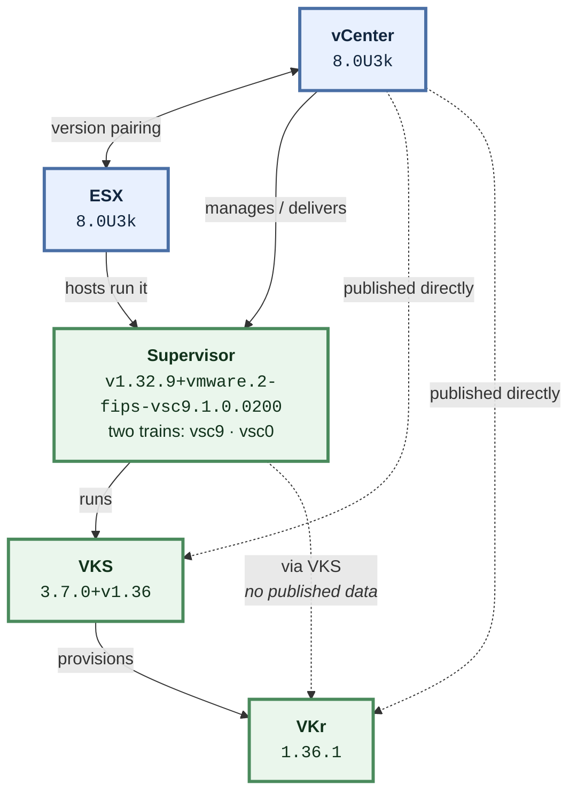

# How vCenter, ESX, Supervisor, VKS and VKr fit together

The Broadcom interoperability matrix answers one question at a time:
"is A compatible with B". This is the shape of the whole dependency,
which is the part that usually has to be drawn on a whiteboard.

## What each relationship means

- **vCenter → ESX** *(published in the matrix)* — vCenter and ESX are upgraded as a pair, and vCenter must be at or ahead of the ESX hosts it manages — so vCenter moves first.
- **vCenter → Supervisor** *(published in the matrix)* — vCenter delivers and manages the Supervisor, and largely determines which Supervisor versions are available. Watch the "vsc" tail on the Supervisor version: it names the release train. vsc9.x ships with vCenter 9.x ("vsc9.1.0.0200" is literally vCenter 9.1.0.0200); vsc0.x is versioned independently. The same Kubernetes version exists on both trains and they are not interchangeable — Supervisor 1.31 on vsc9 is a different thing from Supervisor 1.31 on vsc0, and a vCenter 8 deployment takes only the latter.
- **ESX → Supervisor** *(published in the matrix)* — The Supervisor control plane and its workloads run on the ESX hosts in the cluster, so the host version gates which Supervisor versions can be enabled.
- **Supervisor → VKS** *(published in the matrix)* — VKS runs on top of the Supervisor and is what turns it into a service that can provision guest Kubernetes clusters.
- **VKS → VKr** *(published in the matrix)* — VKS provisions guest clusters at a specific Kubernetes release; the VKS version declares the Kubernetes minor it serves (the "+v1.36" tail), which is what bounds the usable VKr versions.
- **vCenter → VKS** *(published in the matrix)* — vCenter is the hub of the published matrix and has a direct compatibility edge to VKS, which is what makes it possible to solve a whole stack from a single pinned vCenter version.
- **vCenter → VKr** *(published in the matrix)* — vCenter also has a direct published edge to VKr, giving a second independent constraint on the guest cluster version.
- **Supervisor → VKr** *(inferred — upstream publishes nothing for this pair)* — There is no published Supervisor-to-VKr data upstream. The relationship is real but has to be inferred through VKS and vCenter, so this tool reports it as inferred rather than verified.

## Reading the versions

**Supervisor ships 2 trains: vsc9 and vsc0.** vsc9.x ships with vCenter 9.x; vsc0.x is versioned independently. The same Kubernetes version exists on both and they are not interchangeable.

## Where the answers get summarised

- Supervisor, VKS and VKr are grouped by version line — one node covers several builds, and the count is shown on the node. Hover it for the exact list.
- Supervisor is additionally split by release train (vsc9 and vsc0), because the same Kubernetes version on the two trains is not the same thing.
- vCenter is never grouped. Its patch letter changes what it supports: 8.0U3 takes Supervisor 1.26–1.28, while 8.0U3k takes 1.31–1.33.
- ESX is not shown as a layer. Its release lines mirror vCenter's and it has no published data against VKS or VKr, so it appears as the hosts each vCenter runs on.

## What this tool does not know

Every limit below is stated rather than glossed. A compatibility tool that
presents a gap as an answer is worse than no tool.

### ESX × VKS is not published

The interoperability matrix returns nothing at all for ESX against VKS — not an empty result, but no data. Nobody has stated whether these two work together.

*What it means:* In practice this costs nothing: it is not a combination anyone configures directly.

*What to do:* Constrain through vCenter and Supervisor instead, which are published.

### ESX × VKr is not published

The interoperability matrix returns nothing at all for ESX against VKr — not an empty result, but no data. Nobody has stated whether these two work together.

*What it means:* In practice this costs nothing: it is not a combination anyone configures directly.

*What to do:* Constrain through vCenter and Supervisor instead, which are published.

### Supervisor × VKr is not published

The interoperability matrix returns nothing at all for Supervisor against VKr — not an empty result, but no data. Nobody has stated whether these two work together.

*What it means:* This is the gap that matters. It is a question people genuinely ask, and there is no direct answer to look up.

*What to do:* This tool answers it indirectly: VKS sits between them and is published against both, and vCenter is published against both, so a combination that satisfies those is reported — always labelled inferred, never as verified compatible.

### Whether an upgrade is actually safe to perform

The matrix says which versions may coexist. It says nothing about order, downtime, data migration, or whether a given hop is supported as an upgrade rather than as a fresh install.

*What it means:* A stack this tool calls valid is a valid destination. It is not a statement that you can get there from where you are.

*What to do:* Treat the upgrade ordering here as a starting point and confirm against the product upgrade documentation before executing.

### Anything about releases upstream has not published yet

Unreleased versions appear in the product list before any compatibility data exists for them.

*What it means:* They show as "no data yet" rather than being hidden, so you can see that a version exists without being told anything false about it.

*What to do:* Re-run `interop refresh` once the release ships.

### Whether "compatible, not tested" will work for you

The matrix distinguishes tested-compatible from compatible-but-not-tested. This tool treats both as a yes.

*What it means:* A stack can be reported valid on the strength of a combination nobody has actually run.

*What to do:* `interop compat <product> <version>` marks which results are not tested.

### Older releases, by choice

vCenter and ESX below 8.0 U3 are filtered out, and Supervisor, VKS and VKr are dropped when nothing above that floor can reach them.

*What it means:* The answers are scoped to currently relevant versions, not to everything the matrix knows.

*What to do:* `--all-versions` disables the floor; `--min-version vcenter=9.0.0.0` moves it.

## Upgrade order

vCenter → ESX → Supervisor → VKS → VKr

vCenter moves first because it must be at or ahead of the hosts and the
Supervisor it manages; the guest clusters move last. This ordering is
operational knowledge, not something the matrix states — see the limits above.

<!-- Generated by `interop explain`. Edit internal/model, not this file. -->
