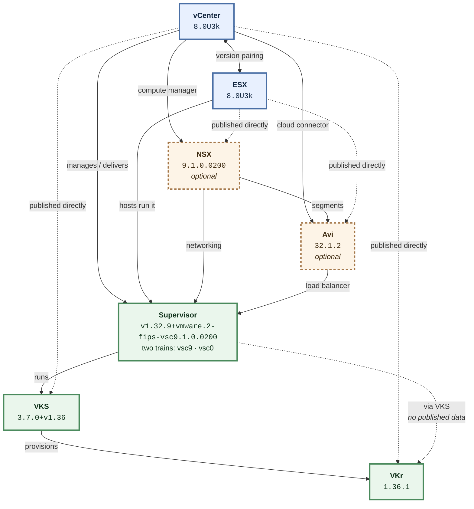

# How vCenter, ESX, NSX, Avi, Supervisor, VKS and VKr fit together

The Broadcom interoperability matrix answers one question at a time:
"is A compatible with B". This is the shape of the whole dependency,
which is the part that usually has to be drawn on a whiteboard.

Five of these are in every stack. **NSX and Avi are optional and
independent**: a Supervisor runs on NSX networking, or on a vSphere
Distributed Switch with Avi in front of it, or on neither. Opt into each
on its own — asking for one never brings in the other.

## What each relationship means

- **vCenter → ESX** *(published in the matrix)* — vCenter and ESX are upgraded as a pair, and vCenter must be at or ahead of the ESX hosts it manages — so vCenter moves first.
- **vCenter → Supervisor** *(published in the matrix)* — vCenter delivers and manages the Supervisor, and largely determines which Supervisor versions are available. Watch the "vsc" tail on the Supervisor version: it names the release train. vsc9.x ships with vCenter 9.x ("vsc9.1.0.0200" is literally vCenter 9.1.0.0200); vsc0.x is versioned independently. The same Kubernetes version exists on both trains and they are not interchangeable — Supervisor 1.31 on vsc9 is a different thing from Supervisor 1.31 on vsc0, and a vCenter 8 deployment takes only the latter.
- **ESX → Supervisor** *(published in the matrix)* — The Supervisor control plane and its workloads run on the ESX hosts in the cluster, so the host version gates which Supervisor versions can be enabled.
- **Supervisor → VKS** *(published in the matrix)* — VKS runs on top of the Supervisor and is what turns it into a service that can provision guest Kubernetes clusters.
- **VKS → VKr** *(published in the matrix)* — VKS provisions guest clusters at a specific Kubernetes release; the VKS version declares the Kubernetes minor it serves (the "+v1.36" tail), which is what bounds the usable VKr versions.
- **vCenter → VKS** *(published in the matrix)* — vCenter is the hub of the published matrix and has a direct compatibility edge to VKS, which is what makes it possible to solve a whole stack from a single pinned vCenter version. It is not a dependency, though: VKS runs on the Supervisor, so enforcing this pair would rule out combinations that work. It is looked up, never used to include or exclude.
- **vCenter → VKr** *(published in the matrix)* — vCenter also has a direct published edge to VKr, giving a second independent reference point. Like the VKS pair it is not a dependency — VKr is provisioned by VKS — so it informs rather than constrains.
- **Supervisor → VKr** *(inferred — upstream publishes nothing for this pair)* — There is no published Supervisor-to-VKr data upstream. The relationship is real but has to be inferred through VKS and vCenter, so this tool reports it as inferred rather than verified.
- **vCenter → NSX** *(published in the matrix)* — NSX is optional — plenty of vSphere runs without it — but where it is deployed the NSX manager registers vCenter as a compute manager, and that pairing is versioned. Upstream publishes this pair directly.
- **ESX → NSX** *(published in the matrix)* — NSX does prepare the ESX hosts as transport nodes, and upstream publishes the pair. It is not enforced, because vCenter and ESX move together and NSX is already constrained against vCenter: adding the host pair rules out nothing the vCenter pair does not, and costs a great deal of search to discover that. NSX is constrained against vCenter, the Supervisor and Avi, and nothing else. This pair is looked up and reported.
- **NSX → Supervisor** *(published in the matrix)* — A Supervisor can be enabled on NSX networking or on a vSphere Distributed Switch. On NSX, the NSX version gates which Supervisor versions can be enabled, and upstream publishes the pair. A Supervisor on VDS has no NSX in the picture at all, which is why NSX is optional rather than part of every stack.
- **vCenter → Avi** *(published in the matrix)* — Avi Load Balancer — the product formerly sold as NSX Advanced Load Balancer — talks to vCenter through its vSphere cloud connector to place service engines, so the controller version is paired with vCenter. Upstream publishes this pair directly.
- **NSX → Avi** *(published in the matrix)* — Where NSX and Avi are deployed together the Avi service engines attach to NSX segments, and the two versions are paired. This constrains a stack only when both are chosen: Avi on a vSphere Distributed Switch with no NSX anywhere is an ordinary deployment, and Avi never requires NSX.
- **Avi → Supervisor** *(published in the matrix)* — A Supervisor on VDS networking needs an external load balancer, and Avi is the supported choice. The pair is published, so where Avi is deployed it gates which Supervisor versions can be enabled. A Supervisor on NSX uses NSX load balancing instead and has no Avi in the picture.
- **ESX → Avi** *(published in the matrix)* — Upstream publishes an ESX-to-Avi pair, but it is almost entirely empty: at the time of writing three cells in the whole grid say yes, all of them Avi 32.1.1 against ESX 9.1.x. Enforcing it would collapse every Avi-bearing stack to that one combination and rule out deployments that plainly work. Avi service engines are placed through vCenter, so vCenter is the pair that decides. This one is looked up and reported, never used to include or exclude.

## Reading the versions

**Supervisor ships 2 trains: vsc9 and vsc0.** vsc9.x ships with vCenter 9.x; vsc0.x is versioned independently. The same Kubernetes version exists on both and they are not interchangeable.

## Where the answers get summarised

- Supervisor, VKS and VKr are grouped by version line — one node covers several builds, and the count is shown on the node. Hover it for the exact list.
- Supervisor is additionally split by release train (vsc9 and vsc0), because the same Kubernetes version on the two trains is not the same thing.
- vCenter is never grouped. Its patch letter changes what it supports: 8.0U3 takes Supervisor 1.26–1.28, while 8.0U3k takes 1.31–1.33.
- ESX is not shown as a layer. Its release lines mirror vCenter's and it has no published data against VKS or VKr, so it appears as the hosts each vCenter runs on.
- NSX and Avi are grouped by their major.minor line — NSX 9.1 covers 9.1.0.0 through 9.1.0.0200, Avi 32.1 covers 32.1.1 and 32.1.2.
- NSX and Avi are optional layers and start collapsed. Expanding or pinning one has no effect on the other: they are separate choices, and Avi does not require NSX.

## What this tool does not know

Every limit below is stated rather than glossed. A compatibility tool that
presents a gap as an answer is worse than no tool.

### ESX × VKS is not published

The interoperability matrix returns nothing at all for ESX against VKS — not an empty result, but no data. Nobody has stated whether these two work together.

*What it means:* In practice this costs nothing: it is not a combination anyone configures directly.

*What to do:* Constrain through vCenter and Supervisor instead, which are published.

### ESX × VKr is not published

The interoperability matrix returns nothing at all for ESX against VKr — not an empty result, but no data. Nobody has stated whether these two work together.

*What it means:* In practice this costs nothing: it is not a combination anyone configures directly.

*What to do:* Constrain through vCenter and Supervisor instead, which are published.

### NSX × VKS is not published

The interoperability matrix returns nothing at all for NSX against VKS — not an empty result, but no data. Nobody has stated whether these two work together.

*What it means:* In practice this costs nothing: it is not a combination anyone configures directly.

*What to do:* Constrain through vCenter and Supervisor instead, which are published.

### NSX × VKr is not published

The interoperability matrix returns nothing at all for NSX against VKr — not an empty result, but no data. Nobody has stated whether these two work together.

*What it means:* In practice this costs nothing: it is not a combination anyone configures directly.

*What to do:* Constrain through vCenter and Supervisor instead, which are published.

### Avi × VKS is not published

The interoperability matrix returns nothing at all for Avi against VKS — not an empty result, but no data. Nobody has stated whether these two work together.

*What it means:* In practice this costs nothing: it is not a combination anyone configures directly.

*What to do:* Constrain through vCenter and Supervisor instead, which are published.

### Avi × VKr is not published

The interoperability matrix returns nothing at all for Avi against VKr — not an empty result, but no data. Nobody has stated whether these two work together.

*What it means:* In practice this costs nothing: it is not a combination anyone configures directly.

*What to do:* Constrain through vCenter and Supervisor instead, which are published.

### Supervisor × VKr is not published

The interoperability matrix returns nothing at all for Supervisor against VKr — not an empty result, but no data. Nobody has stated whether these two work together.

*What it means:* This is the gap that matters. It is a question people genuinely ask, and there is no direct answer to look up.

*What to do:* This tool answers it indirectly: VKS sits between them and is published against both, and vCenter is published against both, so a combination that satisfies those is reported — always labelled inferred, never as verified compatible.

### Which optional components a deployment actually has

NSX and Avi are each present in some deployments and absent from others, and nothing upstream says which. A Supervisor can run on NSX networking or on a vSphere Distributed Switch with Avi in front of it, or on neither.

*What it means:* A solved stack leaves NSX and Avi out unless you ask for them, so an answer that does not mention NSX is not a claim that you have no NSX — it is a claim about the five components that are always there.

*What to do:* Pin a version (`--nsx 9.1.0.0200`) or opt in by name (`--with nsx`, `--with avi`, `--with nsx,avi`). The two are independent: asking for one never pulls in the other.

### Whether Avi and ESX versions really are that restricted

Upstream publishes an ESX × Avi pair, but almost every cell in it is empty — at the time of writing three say yes, all of them Avi 32.1.1 against ESX 9.1.x. Avi is not deployed onto hosts directly; its service engines are placed through vCenter.

*What it means:* This tool reports the pair but never enforces it. Enforcing it would rule out Avi deployments that plainly work, so a stack can be called valid even though the ESX × Avi cell is blank.

*What to do:* `vkstack compat avi <version>` shows the pair as it is published, blanks and all.

### Whether an upgrade is actually safe to perform

The matrix says which versions may coexist. It says nothing about order, downtime, data migration, or whether a given hop is supported as an upgrade rather than as a fresh install.

*What it means:* A stack this tool calls valid is a valid destination. It is not a statement that you can get there from where you are.

*What to do:* Treat the upgrade ordering here as a starting point and confirm against the product upgrade documentation before executing.

### Anything about releases upstream has not published yet

Unreleased versions appear in the product list before any compatibility data exists for them.

*What it means:* They show as "no data yet" rather than being hidden, so you can see that a version exists without being told anything false about it.

*What to do:* Re-run `vkstack refresh` once the release ships.

### Whether "compatible, not tested" will work for you

The matrix distinguishes tested-compatible from compatible-but-not-tested. This tool treats both as a yes.

*What it means:* A stack can be reported valid on the strength of a combination nobody has actually run.

*What to do:* `vkstack compat <product> <version>` marks which results are not tested.

### Older releases, by choice

vCenter and ESX below 8.0 U3 are filtered out, and Supervisor, VKS and VKr are dropped when nothing above that floor can reach them.

*What it means:* The answers are scoped to currently relevant versions, not to everything the matrix knows.

*What to do:* `--all-versions` disables the floor; `--min-version vcenter=9.0.0.0` moves it.

## Upgrade order

vCenter → ESX → NSX → Avi → Supervisor → VKS → VKr

vCenter moves first because it must be at or ahead of the hosts and the
Supervisor it manages; the guest clusters move last. This ordering is
operational knowledge, not something the matrix states — see the limits above.

<!-- Generated by `vkstack explain`. Edit internal/model, not this file. -->
