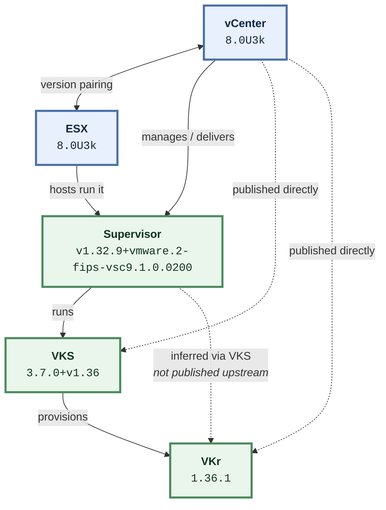

# How vCenter, ESX, Supervisor, VKS and VKr fit together

The Broadcom interoperability matrix answers one question at a time:
"is A compatible with B". This is the shape of the whole dependency,
which is the part that usually has to be drawn on a whiteboard.

## What each relationship means

- **vCenter → ESX** — vCenter and ESX are upgraded as a pair, and vCenter must be at or ahead of the ESX hosts it manages — so vCenter moves first.
- **vCenter → Supervisor** — vCenter delivers and manages the Supervisor, and largely determines which Supervisor versions are available — the Supervisor version string embeds the vCenter line it ships with (the "vsc9.1.0.0200" tail).
- **ESX → Supervisor** — The Supervisor control plane and its workloads run on the ESX hosts in the cluster, so the host version gates which Supervisor versions can be enabled.
- **Supervisor → VKS** — VKS runs on top of the Supervisor and is what turns it into a service that can provision guest Kubernetes clusters.
- **VKS → VKr** — VKS provisions guest clusters at a specific Kubernetes release; the VKS version declares the Kubernetes minor it serves (the "+v1.36" tail), which is what bounds the usable VKr versions.
- **vCenter → VKS** — vCenter is the hub of the published matrix and has a direct compatibility edge to VKS, which is what makes it possible to solve a whole stack from a single pinned vCenter version.
- **vCenter → VKr** — vCenter also has a direct published edge to VKr, giving a second independent constraint on the guest cluster version.
- **Supervisor → VKr** — There is no published Supervisor-to-VKr data upstream. The relationship is real but has to be inferred through VKS and vCenter, so this tool reports it as inferred rather than verified. *(not published upstream)*

## Upgrade order

vCenter → ESX → Supervisor → VKS → VKr

vCenter moves first because it must be at or ahead of the hosts and the
Supervisor it manages; the guest clusters move last.

## A note on the data

Not every pair above is published upstream. Where a pair is marked
*not published*, this tool infers the relationship through the products that
are published — and always labels the result inferred rather than verified.

<!-- Generated by `interop explain`. Edit internal/model, not this file. -->
